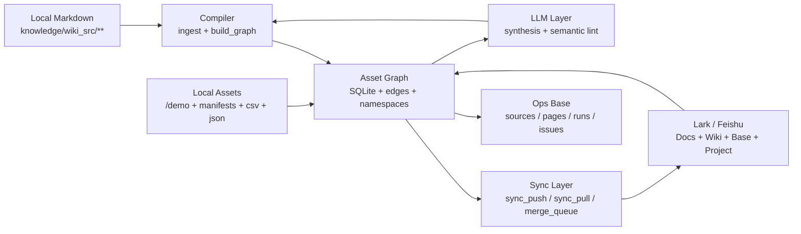
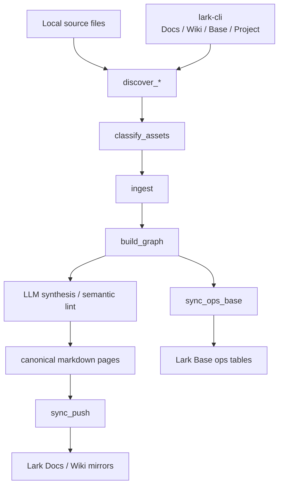

# lark-wiki

> 本地优先的 Lark / Feishu x LLM wiki starter，给 AI agents 一个能落地、能同步、能留痕的知识编译器。  
> A local-first Lark / Feishu x LLM wiki starter that gives AI agents a real knowledge compiler with sync and operational traceability.

`#feishu #lark #lark-cli #llm-wiki #ai-agents #knowledge-ops #markdown #bitable #wiki-sync`

## 为什么有这个仓库

很多 agent demo 都停在“能写一段总结”，但真正可交付的工作流还缺三件事：

- 本地 Markdown 要做 canonical truth，而不是让远端文档反客为主
- Lark / Feishu 要能当成协作面和运行面，而不只是一个附件盒子
- LLM 要参与 synthesis 和 lint，但不能脱离 source 胡说

`lark-wiki` 解决的是这三个问题一起出现时的工程化骨架。

Most agent demos stop at “the model can summarize”. Real workflows still need three things:

- local Markdown as canonical truth
- Lark / Feishu as collaboration and ops surfaces
- LLM synthesis that stays grounded in sources

`lark-wiki` is the starter kit for that combined shape.

## 架构总览

这不是笔记软件模板，而是一个 local-first knowledge compiler。

This is not a note-taking vault template. It is a local-first knowledge compiler.



### Core model

- `knowledge/wiki_src/**` 是 canonical pages
- `state/llm_wiki_v1.sqlite` 是本地状态库
- `knowledge/raw/**` 是抓取快照
- `knowledge/build/**` 是图谱和编译产物
- Lark Docs / Wiki 是阅读与协作面
- Lark Base 是 ops control plane

- `knowledge/wiki_src/**` is the canonical page set
- `state/llm_wiki_v1.sqlite` is the local state DB
- `knowledge/raw/**` stores fetched snapshots
- `knowledge/build/**` stores compiled graph artifacts
- Lark Docs / Wiki is the collaboration surface
- Lark Base is the operational control plane

## `lark-cli` 安装与授权

推荐走飞书官方公开安装路径。

Use the official Feishu CLI path for setup.

### 1. 安装 CLI

```bash
npm install -g @larksuite/cli
```

### 2. 安装 agent skills

```bash
npx skills add https://github.com/larksuite/cli -y -g
```

### 3. 初始化配置

```bash
lark-cli config init --new
```

### 4. 完成授权

```bash
lark-cli auth login
```

如果你的 CLI 版本支持推荐流，也可以使用：

If your CLI build supports the guided flow, you can also use:

```bash
lark-cli auth login --recommend
```

### 5. 验证安装

```bash
lark-cli help
lark-cli auth status
lark-cli doctor
```

官方参考：

- [飞书 CLI 安装与使用指南](https://www.feishu.cn/content/article/7623291503305083853)
- [larksuite/cli on GitHub](https://github.com/larksuite/cli)

## `LLM wiki` 配置

默认配置在 [`scripts/lark_wiki/defaults.toml`](scripts/lark_wiki/defaults.toml)，本地覆盖建议从 [`examples/llm_wiki_v1.local.example.toml`](examples/llm_wiki_v1.local.example.toml) 复制到 `state/llm_wiki_v1.local.toml`。

Defaults live in [`scripts/lark_wiki/defaults.toml`](scripts/lark_wiki/defaults.toml). Start local overrides by copying [`examples/llm_wiki_v1.local.example.toml`](examples/llm_wiki_v1.local.example.toml) to `state/llm_wiki_v1.local.toml`.

```toml
[llm]
provider = "mock"
model = "gpt-5.4-mini"
command = ""
timeout_seconds = 240
max_assets_per_prompt = 4
max_chars_per_asset = 3200
semantic_lint_enabled = true
```

想直接连真实模型时，把 `provider` 改成 `auto` 或 `codex_exec`。

When you want real synthesis, switch `provider` to `auto` or `codex_exec`.

### LLM 字段说明

| 字段 | 作用 |
| --- | --- |
| `provider` | 选择 LLM provider 模式 |
| `model` | provider 使用的模型名 |
| `command` | 当 `provider = "command"` 时调用的自定义命令 |
| `timeout_seconds` | 单次 synthesis / lint 调用超时 |
| `max_assets_per_prompt` | 每次 prompt 最多拼多少条 source |
| `max_chars_per_asset` | 单条 source 最多截多少字符 |
| `semantic_lint_enabled` | 是否启用语义 lint |

| Field | Meaning |
| --- | --- |
| `provider` | selects the LLM provider mode |
| `model` | model name for the provider |
| `command` | custom command used by `provider = "command"` |
| `timeout_seconds` | timeout per synthesis / lint call |
| `max_assets_per_prompt` | max number of source assets per prompt |
| `max_chars_per_asset` | max characters kept from each source |
| `semantic_lint_enabled` | enables semantic lint passes |

### Provider modes

- `disabled`: 不跑 LLM，只保留结构化编译和同步
- `mock`: 用假数据返回，适合本地测试和 CI
- `command`: 把 JSON payload 交给你自己的命令
- `codex_exec`: 直接通过 `codex exec` 做 grounded synthesis
- `auto`: 优先找 `codex`，找不到时回退到 `command`，再不行就禁用

- `disabled`: no LLM, only structure and sync
- `mock`: fake outputs for local testing and CI
- `command`: hand JSON payloads to your own command
- `codex_exec`: use `codex exec` for grounded synthesis
- `auto`: prefer `codex`, fall back to `command`, else disable

## `lark-cli` 和 `LLM wiki` 怎么结合

一句话：`lark-cli` 负责接平台，`LLM wiki` 负责接语义。

In one line: `lark-cli` connects the surfaces, `LLM wiki` adds grounded synthesis.



### 实际分工

- `lark-cli` 把 Docs / Wiki / Base / Project 暴露成可编排命令
- `discover_*` 把远端和本地都注册成 assets
- `classify_assets` 把资产归到 namespace
- `ingest` 生成 canonical pages
- `build_graph` 生成页面与资产图谱
- `LLM synthesis` 给重点页面补 grounded summary
- `sync_push` / `sync_pull` 处理远端镜像和冲突
- `sync_ops_base` 把 sources/pages/runs/issues 镜像到 Base

## Synthetic demo namespace

这个仓库自带的是**完全脱敏**的 synthetic demo，不是任何私有项目的改写版。

The bundled demo is fully synthetic. It is not adapted from a private project.

### Repo shape

```text
demo/
  agent_workspace_assets/
examples/
  llm_wiki_v1.local.example.toml
knowledge/
  wiki_src/
    account/
    shared/
    inbox/
    projects/
      agent_workspace/
scripts/
  lark_wiki.py
  lark_wiki/
tests/
  test_lark_wiki.py
```

### Demo namespaces

- `account`: portfolio root, governance and index
- `project::agent_workspace`: synthetic AI agent workspace
- `shared`: shared-but-explicit assets only
- `inbox`: unclassified holding area

### Demo pages

项目 demo 至少覆盖：

- `Home`
- `Index`
- `Log`
- `Source`: `asset_inventory`, `remote_docs_registry`, `ops_base_registry`, `state_lineage_registry`
- `Entity`: `agent_ops_catalog`
- `Concept`: `agent_system_map`
- `Report`: `execution_readiness_report`, `handoff_risks_report`

The project demo ships with:

- `Home`
- `Index`
- `Log`
- `Source` pages
- one `Entity`
- one `Concept`
- two `Report` pages

## 命令参考

主入口：

Main entrypoint:

```bash
python3 scripts/lark_wiki.py --help
```

### Starter flow

```bash
python3 scripts/lark_wiki.py bootstrap_portfolio
python3 scripts/lark_wiki.py discover_local_repo_assets
python3 scripts/lark_wiki.py classify_assets

python3 scripts/lark_wiki.py ingest --namespace account
python3 scripts/lark_wiki.py ingest --namespace project::agent_workspace
python3 scripts/lark_wiki.py ingest --namespace shared
python3 scripts/lark_wiki.py ingest --namespace inbox

python3 scripts/lark_wiki.py build_graph --namespace account
python3 scripts/lark_wiki.py build_graph --namespace project::agent_workspace
python3 scripts/lark_wiki.py build_graph --namespace shared
python3 scripts/lark_wiki.py build_graph --namespace inbox
```

### Discovery and sync

```bash
python3 scripts/lark_wiki.py discover_feishu_docs
python3 scripts/lark_wiki.py discover_feishu_bases
python3 scripts/lark_wiki.py discover_feishu_project
python3 scripts/lark_wiki.py discover_state_lineage

python3 scripts/lark_wiki.py lint --namespace project::agent_workspace
python3 scripts/lark_wiki.py sync_push --namespace project::agent_workspace
python3 scripts/lark_wiki.py sync_pull --namespace project::agent_workspace
python3 scripts/lark_wiki.py merge_patches --namespace project::agent_workspace

python3 scripts/lark_wiki.py bootstrap_ops_base
python3 scripts/lark_wiki.py sync_ops_base
```

### Tests

```bash
python3 -m unittest tests/test_lark_wiki.py
```

## 隐私与 local-first 保证

- 本地 Markdown 永远是 canonical truth
- `state/` 不入 git
- `knowledge/raw/`、`knowledge/assets/`、`knowledge/build/` 默认不入 git
- demo 内容全部是 synthetic，不带真实 Feishu URL、真实 node token、真实项目名
- 远端文档是 mirror / work surface，不是正文真源

- local Markdown remains canonical truth
- `state/` stays out of git
- `knowledge/raw/`, `knowledge/assets/`, and `knowledge/build/` are ignored by default
- demo content is fully synthetic with no real project identifiers
- remote docs are mirrors and work surfaces, not the canonical source

## 下一步

1. 安装并授权 `lark-cli`
2. 复制 example TOML 到 `state/llm_wiki_v1.local.toml`
3. 把你的 wiki seed nodes / base tokens / project env 配进去
4. 先跑本地 starter flow，再打开远端同步

1. Install and authorize `lark-cli`
2. Copy the example TOML to `state/llm_wiki_v1.local.toml`
3. Fill in your seed nodes / base tokens / project env
4. Run the local starter flow before turning on remote sync
