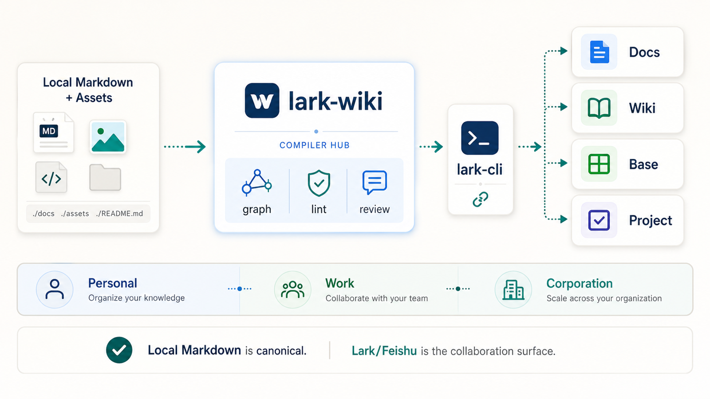
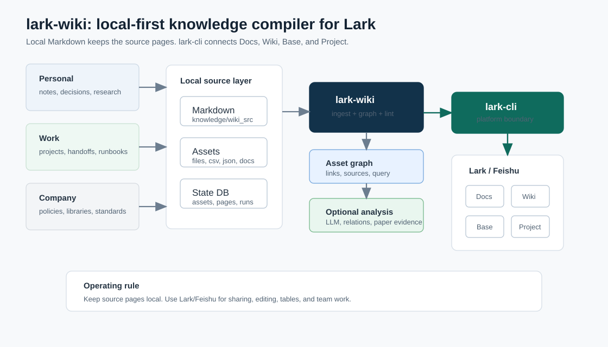

# lark-wiki

> 🧠 面向 Lark/Feishu 的 `lark-cli`-first LLM Wiki：本地 Markdown 管理知识源，飞书承载协作、检索和团队使用。

`lark-wiki` 借鉴 Karpathy LLM wiki 的知识组织理念。它把“能问、能找、能总结”的个人知识库，变成能在 Lark/Feishu 里真正协作的工作系统：本地 Markdown 放原文和最终版本，飞书 Docs / Wiki / Base 负责协作，LLM、论文工作台和知识关系图负责把内容变得更好用。

它的目标是成为最好用的飞书个人知识库底座，同时也能自然扩展到工作项目和公司协作场景。和 Obsidian 这类个人笔记软件不同，`lark-wiki` 把协作、权限、表格、项目和消息放在飞书侧，把原始资料和整理后的页面留在本地。



## ✨ 为什么需要它

很多知识库会散成三份：本地文档、飞书文档、表格和项目管理里的状态。`lark-wiki` 把它们统一到一条清晰链路中：

```text
Local Markdown + Assets
        -> lark-wiki compiler
        -> graph / lint / summaries
        -> lark-cli
        -> Lark Docs / Wiki / Base work surfaces
```

核心原则很简单：

| 原则 | 含义 |
| --- | --- |
| Local-first | `knowledge/wiki_src/**` 存放原文和整理后的页面，出问题可以改回去 |
| Lark-native | Docs/Wiki/Base 通过 `lark-cli` 接入，适合国内个人和团队工作流 |
| Source-based | LLM 只看你给它的资料，帮你总结、找冲突、补遗漏 |
| Human in control | 论文、关系图和远端改动都先给人看，再放进正式页面 |

## 🚀 真正拉开差距的组件

`lark-wiki` 不是只把一堆 Markdown 喂给 LLM。真正强的是两件事：把论文结论讲清楚，把知识之间的关系连起来。这样个人知识库才能直接长成团队能用的工作系统。

| Component | 为什么重要 |
| --- | --- |
| Paper Evidence Workbench | 不只是总结 paper，而是帮你记清楚：这篇论文说了什么、支持哪个结论、哪些地方还不确定。 |
| Knowledge Relation Map | 把文档、来源、页面和项目连起来。知识不再是散落文件，而是一张能搜索、能跳转、能复用的网络。 |

这两块能力让 `lark-wiki` 超出“个人 LLM wiki demo”：它能服务个人研究，也能支撑项目交付、公司 Wiki、Base-backed ops 和多人协作。

## 🧩 适合谁

| 场景 | 适合内容 |
| --- | --- |
| 🧠 个人知识库 | 笔记、阅读、论文、决策、灵感、生活/工作操作系统 |
| 🧰 工作项目 Wiki | Runbook、handoff、会议纪要、状态同步、风险记录 |
| 🏢 公司协作 Wiki | 共享制度、流程库、项目组合视图、Base 支撑的运营台账 |

默认命名空间：

| Namespace | 用途 |
| --- | --- |
| `account` | portfolio home、总索引、管理页、运行日志 |
| `project::<slug>` | 个人、项目、团队、客户或部门知识空间 |
| `shared` | 已审核的共享规则、术语、标准和模板 |
| `inbox` | 未分类资产的暂存区 |

## ⚡ Quickstart

### 1. 本地跑通

这个流程不需要远端授权，会写入本地 `state/` 和 `knowledge/build/`。

```bash
python3 scripts/lark_wiki.py --help
python3 scripts/lark_wiki.py bootstrap_portfolio
python3 scripts/lark_wiki.py discover_local_repo_assets
python3 scripts/lark_wiki.py classify_assets
python3 scripts/lark_wiki.py ingest --namespace project::agent_workspace
python3 scripts/lark_wiki.py build_graph --namespace project::agent_workspace
python3 scripts/lark_wiki.py lint --namespace project::agent_workspace
python3 scripts/lark_wiki.py query --namespace project::agent_workspace --query handoff
```

### 2. 配置本地 workspace

```bash
mkdir -p state
cp examples/llm_wiki_v1.local.example.toml state/llm_wiki_v1.local.toml
```

把凭据、seed nodes、Base identifiers 和本机路径只放在 `state/`。该目录默认不进入 git。

### 3. 连接 Lark/Feishu

```bash
npm install -g @larksuite/cli@1.0.19
lark-cli config init --new
lark-cli auth login
lark-cli doctor
```

Optional:

```bash
npx skills add https://github.com/larksuite/cli -y -g
```

### 4. 远端发现与同步

先同步 account/root，再同步 project，避免 project push 缺少父级 Wiki root。

```bash
python3 scripts/lark_wiki.py upgrade_preflight
python3 scripts/lark_wiki.py discover_feishu_docs
python3 scripts/lark_wiki.py discover_feishu_bases
python3 scripts/lark_wiki.py classify_assets
python3 scripts/lark_wiki.py ingest --namespace account
python3 scripts/lark_wiki.py build_graph --namespace account
python3 scripts/lark_wiki.py sync_push --namespace account --limit 1
python3 scripts/lark_wiki.py ingest --namespace project::agent_workspace
python3 scripts/lark_wiki.py build_graph --namespace project::agent_workspace
python3 scripts/lark_wiki.py sync_push --namespace project::agent_workspace --limit 1
```

Command safety:

| Type | Commands |
| --- | --- |
| Writes local state, no remote API | `bootstrap_portfolio`, `bootstrap_namespace`, `discover_local_repo_assets`, `classify_assets`, `ingest`, `build_graph`, `query --query <text>` |
| Usually local, may fetch bound mirrors | `lint` |
| Remote read + local snapshot | `upgrade_preflight`, `discover_feishu_docs`, `discover_feishu_bases`, `discover_feishu_project`, `sync_pull` |
| Remote write | `sync_push`, `bootstrap_ops_base`, `sync_ops_base` |

## 🛠️ 场景教程

| Tutorial | 用途 |
| --- | --- |
| [Personal Life OS](examples/tutorials/personal-life-os/README.md) | 个人笔记、阅读、决策和把好内容分享给团队 |
| [Work Delivery Room](examples/tutorials/work-delivery-room/README.md) | 项目交付、handoff、runbook、风险和状态同步 |
| [Company Collaboration OS](examples/tutorials/company-collaboration-os/README.md) | 公司协作 Wiki、共享标准和 Base-backed ops |
| [Research Paper Workbench](examples/tutorials/research-paper-workbench/README.md) | 论文阅读、结论记录、证据整理和相关工作地图 |

已有轻量 starter：

| Starter | 用途 |
| --- | --- |
| [Personal KB](examples/personal/README.md) | 最小个人知识库 |
| [Work Project](examples/work-project/README.md) | 最小项目知识库 |
| [Company OS](examples/company-os/README.md) | account/shared 起步配置 |
| [lark-cli recipes](examples/lark-cli-recipes.md) | 底层平台命令速查 |
| [Optional analysis](examples/optional-analysis.md) | LLM、论文证据整理和知识关系图能力说明 |

## 🧱 技术架构



当前 public CLI 能力边界：

| Surface | 当前支持 |
| --- | --- |
| Docs/Wiki | 通过 `lark-cli` 做 search/fetch/create/update 和 Wiki node 发现/同步 |
| Base | 发现 table/field/record，Ops Base 可镜像 sources/pages/runs/issues/merge queue |
| Project | 支持配置快照和本地 project sync-state 发现，不承诺 live Project API sync |
| Drive | 在 `upgrade_preflight` 中检查平台能力，当前不作为核心同步命令 |

## 📁 Repository Map

```text
assets/                         README visual assets
demo/agent_workspace_assets/     synthetic demo sources
examples/                        starters, tutorials, and recipes
knowledge/wiki_src/              wiki source pages
scripts/lark_wiki.py             public CLI entrypoint
scripts/lark_wiki/               compiler, sync, lint, discovery
tests/                           public starter tests
```

Runtime output is local and ignored:

```text
state/
knowledge/raw/
knowledge/assets/
knowledge/build/
```

## ⚙️ Configuration

Config is layered from general to local:

```text
scripts/lark_wiki/defaults.toml
state/llm_wiki.portfolio.toml
state/llm_wiki.projects.toml
state/llm_wiki_v1.local.toml
state/llm_wiki.projects/*.toml
```

Use `state/llm_wiki_v1.local.toml` for local LLM and workspace settings. Use `state/llm_wiki.projects/*.toml` for per-project starter profiles loaded from `examples/`.

Minimal LLM config:

```toml
[llm]
provider = "disabled"
model = "gpt-5.4-mini"
command = ""
timeout_seconds = 180
max_assets_per_prompt = 6
max_chars_per_asset = 3500
semantic_lint_enabled = true
```

Provider modes:

| Mode | Use |
| --- | --- |
| `disabled` | deterministic compile and sync only |
| `mock` | local tests and CI |
| `command` | call your own JSON command provider |
| `codex_exec` | summarize supplied sources through `codex exec` |
| `auto` | prefer `codex`, then command, else disabled |

## 🔌 Optional Analysis

The core path only needs Python and `lark-cli`. Optional analysis capabilities are workspace-controlled and never replace reviewed pages.

| Capability | Role |
| --- | --- |
| `@larksuite/cli@1.0.19` | required platform connector |
| Knowledge relation map | connect pages, sources, projects, and reusable ideas |
| Paper evidence workspace | paper notes, claim notes, evidence tables |
| LLM provider | summarize supplied sources and flag possible conflicts |

## 🧪 Verify

```bash
python3 scripts/lark_wiki.py --help
python3 -m unittest discover -s tests -v
python3 scripts/lark_wiki.py lint --namespace project::agent_workspace
```

Authenticated runtime check:

```bash
python3 scripts/lark_wiki.py upgrade_preflight
```

Cleanroom scan before public release:

```bash
rg -n "replace-with-your-private-pattern" README.md examples assets scripts tests knowledge
```

## 📚 Command Reference

```text
audit_coverage
bootstrap_namespace
bootstrap_ops_base
bootstrap_portfolio
build_graph
classify_assets
conformance_check
discover_account_assets
discover_feishu_bases
discover_feishu_docs
discover_feishu_project
discover_local_repo_assets
discover_state_lineage
ingest
lint
merge_patches
query --query <text> [--namespace project::<slug>]
snapshot_legacy
sync_ops_base
sync_pull
sync_push
upgrade_preflight
```

## 🧭 Roadmap

- Installable `lark-wiki` console command.
- More guided first-sync docs with screenshots.
- More practical templates for personal, work, and team knowledge systems.
- Clearer setup for optional paper evidence and knowledge relation workflows.
